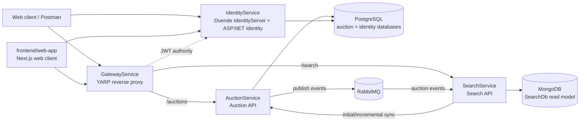
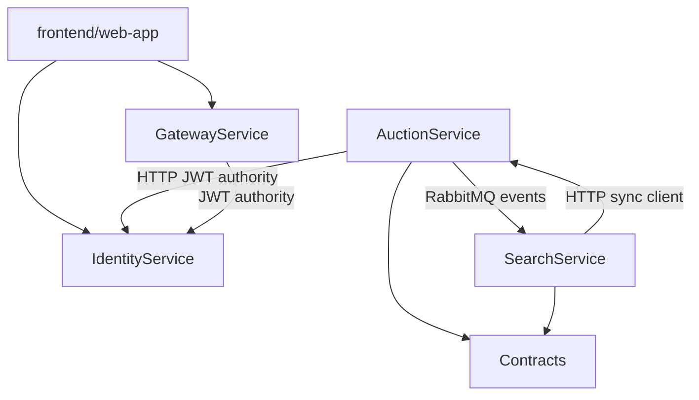

# Carsties

Carsties is a .NET 10 microservices application for vehicle auctions. It exposes a single gateway for clients, uses an identity service for authentication, stores transactional auction data in PostgreSQL, maintains a searchable read model in MongoDB, and uses RabbitMQ for asynchronous integration events.

## Architecture



### Architectural style

- **Microservices:** each deployable service owns a focused business or platform capability.
- **API gateway:** clients normally use `GatewayService`; YARP forwards requests to the internal APIs.
- **Polyglot persistence:** PostgreSQL is used for relational transactional data, while MongoDB stores the denormalized search model.
- **CQRS-like read model:** AuctionService is the source of truth. SearchService builds and updates a query-optimized copy from events and can resynchronize from AuctionService.
- **Event-driven integration:** MassTransit publishes auction lifecycle events to RabbitMQ. Search consumers update MongoDB asynchronously.
- **JWT authentication:** IdentityService issues tokens. AuctionService and GatewayService validate tokens against IdentityServer.
- **Containerized deployment:** every application project has its own multi-stage Dockerfile and Compose service.

## Projects and libraries

### AuctionService

Path: `src/AuctionService/AuctionService.csproj`

AuctionService owns the auction API and the authoritative auction database.

Main libraries:

- **ASP.NET Core Web SDK:** hosts the HTTP API and controllers.
- **Entity Framework Core Design:** supports EF migrations and design-time tooling.
- **Npgsql.EntityFrameworkCore.PostgreSQL:** connects EF Core to PostgreSQL.
- **MassTransit.RabbitMQ:** publishes and consumes messages through RabbitMQ.
- **MassTransit.EntityFrameworkCore:** adds the EF Core inbox/outbox integration. `AuctionDbContext` contains MassTransit inbox and outbox tables so database changes and published events can be coordinated.
- **Microsoft.AspNetCore.Authentication.JwtBearer:** validates JWTs issued by IdentityService.
- **AutoMapper:** maps entities and DTOs, including event contract payloads.
- **ProjectReference to Contracts:** shares message types with other services.

Responsibilities and API behavior:

- `GET /api/auctions` lists auctions and optionally accepts a `date` query parameter for incremental synchronization.
- `GET /api/auctions/{id}` returns one auction.
- Authenticated `POST /api/auctions` creates an auction and publishes `AuctionCreated`.
- Authenticated `PUT /api/auctions/{id}` updates an auction owned by the current user and publishes `AuctionUpdated`.
- Authenticated `DELETE /api/auctions/{id}` deletes an auction owned by the current user and publishes `AuctionDeleted`.
- Database initialization and seed data are handled by `Data/DbInitializer.cs`.
- Consumers handle `BidPlaced`, `AuctionFinished`, and MassTransit fault messages. These support auction-side reactions to asynchronous events.

### frontend/web-app

Path: `frontend/web-app`

The frontend is a private Next.js application that provides the browser client for Carsties Auctions. It uses the App Router and React to render auction listings, search and filtering controls, auction detail and management views, navigation, and session-aware user actions.

Main libraries:

- **Next.js 16:** provides the application runtime, App Router, server actions, and API routes.
- **React 19:** renders the interactive auction experience.
- **NextAuth:** integrates the frontend with the Duende IdentityServer provider and exposes the signed-in user's access token to the application.
- **Zustand:** stores client-side listing parameters such as search and filter state.
- **Flowbite React and React Icons:** provide UI components and icons.
- **TypeScript:** provides static typing for the frontend code.

Responsibilities and application behavior:

- Renders the auction listing page and retrieves search results through the GatewayService `/search` route.
- Provides search, paging, sorting, and status filters for auction listings.
- Supports authenticated session flows through the IdentityService `nextApp` OpenID Connect client.
- Uses the GatewayService `/auctions` routes for authenticated auction operations.
- Protects the session page through the Next.js proxy and NextAuth authorization callbacks.

The frontend runs independently from the .NET Compose services. Its local development server listens on `http://localhost:3000` and expects the gateway and identity endpoints to be available on their published host ports.

### SearchService

Path: `src/SearchService/SearchService.csproj`

SearchService owns the searchable MongoDB read model. It does not own auction transactions.

Main libraries:

- **ASP.NET Core Web SDK:** hosts the search API.
- **MongoDB.Entities:** provides the MongoDB data access abstraction, paging, text search, indexing, and model persistence.
- **MassTransit.RabbitMQ:** consumes auction integration events from RabbitMQ.
- **AutoMapper:** maps shared contracts to search documents.
- **Microsoft.Extensions.Http.Polly:** integrates Polly policies with `HttpClient` for resilient calls to AuctionService.
- **ProjectReference to Contracts:** shares event types with AuctionService.

Responsibilities and API behavior:

- `GET /api/search` supports text search and paging, with filters for `finished`, `endingSoon`, or active auctions, plus sorting by make, newest, or auction end.
- `AuctionCreatedConsumer`, `AuctionUpdatedConsumer`, and `AuctionDeletedConsumer` keep MongoDB synchronized with auction events.
- Startup initialization creates text indexes and performs an incremental synchronization from AuctionService based on the latest `UpdatedAt` value in MongoDB.
- The AuctionService HTTP client retries transient errors and `404 NotFound` responses every three seconds until a request succeeds. RabbitMQ consumer processing retries five times at five-second intervals when MongoDB operations fail.

### IdentityService

Path: `src/IdentityService/IdentityService.csproj`

IdentityService is the authentication and token issuer for the application. It combines a Razor Pages UI, ASP.NET Core Identity user storage, and Duende IdentityServer.

Main libraries:

- **Duende.IdentityServer.AspNetIdentity:** integrates Duende IdentityServer with ASP.NET Core Identity.
- **Microsoft.AspNetCore.Identity.EntityFrameworkCore:** stores users and roles through EF Core.
- **Microsoft.AspNetCore.Identity.UI:** supplies the standard Identity UI/Razor Pages pieces.
- **Microsoft.AspNetCore.Diagnostics.EntityFrameworkCore:** development-time EF error diagnostics.
- **Microsoft.EntityFrameworkCore.Tools:** migration and EF tooling; marked as private build assets.
- **Npgsql.EntityFrameworkCore.PostgreSQL:** stores identity data in PostgreSQL.
- **Serilog.AspNetCore:** structured request and application logging.

Configuration includes:

- OpenID Connect `openid` and `profile` identity resources.
- The `auctionApp` API scope.
- A `postman` resource-owner-password client for development/testing.
- A `nextApp` authorization-code/client-credentials client for the frontend integration.
- A custom profile service that adds username and name claims to identity tokens.
- Docker-mode issuer configuration using `http://localhost:5000`, which is the address clients use to validate tokens.

### GatewayService

Path: `src/GatewayService/GatewayService.csproj`

GatewayService is the client-facing reverse proxy. It has no application database and no message consumers.

Main libraries:

- **Yarp.ReverseProxy:** loads route and cluster definitions from configuration and forwards HTTP requests.
- **Microsoft.AspNetCore.Authentication.JwtBearer:** validates JWTs before protected routes are forwarded.

Configured routes:

| Public path | Methods | Destination | Upstream path |
| --- | --- | --- | --- |
| `/auctions/{**catch-all}` | `GET` | `auction-svc` | `/api/auctions/{**catch-all}` |
| `/auctions/{**catch-all}` | `POST`, `PUT`, `DELETE` | `auction-svc` | `/api/auctions/{**catch-all}` |
| `/search/{**catch-all}` | `GET` | `search-svc` | `/api/search/{**catch-all}` |

Write routes use the `default` authorization policy. Read routes are public at the gateway configuration level, although downstream authorization can still apply.

### Contracts

Path: `src/Contracts/Contracts.csproj`

Contracts is a small .NET 10 class library with no external package references. It contains the shared MassTransit message shapes:

- `AuctionCreated`
- `AuctionUpdated`
- `AuctionDeleted`
- `BidPlaced`
- `AuctionFinished`

The services share this project so publishers and consumers use the same namespace and property names. It contains transport contracts only, not business logic or database models.

## Project dependency relationships



The project references are intentionally one-way:

- `AuctionService -> Contracts`
- `SearchService -> Contracts`
- `GatewayService` has no project reference.
- `IdentityService` has no project reference.
- `Contracts` has no project references.

The frontend has no compile-time project reference to the .NET solution. At runtime it calls GatewayService over HTTP for auction and search data and uses IdentityService for OpenID Connect authentication.

Runtime dependencies are broader than compile-time references. AuctionService and SearchService communicate through RabbitMQ, SearchService calls AuctionService over HTTP for synchronization, and both the gateway and AuctionService use IdentityService as their JWT authority.

## Messaging

RabbitMQ is configured through MassTransit. AuctionService publishes events when auction records are created, updated, or deleted. SearchService consumes those events and updates its MongoDB read model.

The endpoint name formatters use service prefixes:

- AuctionService: `auction-*`
- SearchService: `search-*`
- SearchService explicitly configures the `search-auction-created` receive endpoint for auction-created, updated, and deleted consumers.

This asynchronous path means SearchService is eventually consistent. The startup synchronization path exists to recover or populate the read model when events were missed or MongoDB was empty.

## Data stores

### PostgreSQL

Compose runs one PostgreSQL container named `postgres`. The application uses separate databases:

- `auctions`, used by AuctionService and its EF Core migrations/outbox tables.
- `identity`, used by IdentityService and ASP.NET Identity.

The named volume `pgdata` persists PostgreSQL data between container restarts.

### MongoDB

Compose runs MongoDB as `mongodb`. SearchService uses the `SearchDb` database and stores `Item` documents. Text indexes cover make, model, and color. The named volume `mongodata` persists the search data.

### RabbitMQ

Compose runs `rabbitmq:3-management-alpine`:

- AMQP: `5672`
- Management UI: `15672`

The application containers reach it at the Compose hostname `rabbitmq`.

## Docker and Docker Compose

Each application service is dockerized with a two-stage build:

1. The .NET 10 SDK image restores and publishes the project.
2. The smaller .NET 10 ASP.NET runtime image runs the published DLL on port `80`.

| Project | Dockerfile | Compose service | Image | Host port |
| --- | --- | --- | --- | ---: |
| AuctionService | `src/AuctionService/Dockerfile` | `auction-svc` | `wmeza/auction-svc:latest` | `7001` |
| SearchService | `src/SearchService/Dockerfile` | `search-svc` | `wmeza/search-svc:latest` | `7002` |
| IdentityService | `src/IdentityService/Dockerfile` | `identity-svc` | `wmeza/identity-svc:latest` | `5000` |
| GatewayService | `src/GatewayService/Dockerfile` | `gateway-svc` | `wmeza/gateway-svc:latest` | `6001` |

Compose also defines:

- `postgres` on host port `5432`.
- `mongodb` on host port `27017`.
- `rabbitmq` on host ports `5672` and `15672`.
- Health checks for PostgreSQL, MongoDB, and RabbitMQ.
- `depends_on` health conditions for AuctionService, SearchService, and IdentityService.
- Development/Docker environment variables that override connection strings and internal service URLs.

Inside the Compose network, services must use service names such as `postgres`, `mongodb`, `rabbitmq`, `auction-svc`, and `identity-svc`; `localhost` refers to the current container, not another service.

The frontend is not included in Docker Compose. Run it from `frontend/web-app` with Node.js and npm while the backend Compose services are running.

## Running the application

Prerequisites:

- .NET 10 SDK for local execution.
- Docker Engine and Docker Compose for the containerized setup.

From the repository root:

```bash
docker compose up -d
```

Useful endpoints:

- Frontend: `http://localhost:3000`
- Gateway: `http://localhost:6001`
- IdentityServer: `http://localhost:5000`
- AuctionService direct API: `http://localhost:7001/api/auctions`
- SearchService direct API: `http://localhost:7002/api/search`
- RabbitMQ management UI: `http://localhost:15672`

Start the frontend in a separate terminal:

```bash
cd frontend/web-app
npm install
npm run dev
```

Stop the stack and remove its persisted volumes:

```bash
docker compose down -v
```

Build one service image from the repository root:

```bash
docker compose build auction-svc
```

The `.slnx` solution contains all five projects and can be built with:

```bash
dotnet build Carsties.slnx
```

## Configuration notes and current caveats

- Docker Compose supplies most container-to-container configuration through environment variables. The JSON files provide local defaults and YARP route definitions.
- RabbitMQ credentials are read from `RabitMq:Username` in the service startup code. The key is currently misspelled and is not supplied by Compose, so the code falls back to the default `guest` credentials for both username and password.
- IdentityService uses HTTP and disables HTTPS metadata validation in the Docker-oriented setup. This is suitable for the sample development topology but should be replaced with HTTPS and managed secrets in production.
- `docker compose down -v` deletes PostgreSQL and MongoDB data because it removes the named volumes.
- GatewayService currently has no `depends_on` entry, so it may start before its upstream services are ready; requests will work once the upstream containers are available.
- The sample IdentityServer client configuration contains development credentials and a long-lived access-token lifetime. These values should be replaced before production use.

## Repository layout

```text
Carsties.slnx
 docker-compose.yml
 src/
   AuctionService/      Auction API, EF Core model, consumers, migrations
   SearchService/       Search API, MongoDB read model, event consumers
   IdentityService/     IdentityServer, ASP.NET Identity, Razor Pages
   GatewayService/      YARP reverse proxy and gateway authentication
   Contracts/           Shared MassTransit event contracts
frontend/
    web-app/              Next.js browser client for auction listings and user sessions
```
